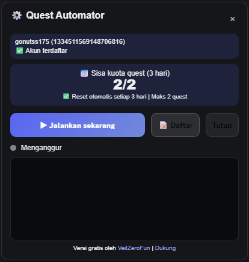
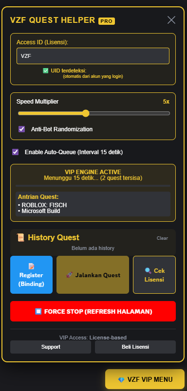

# Discord Quest Helper

> 🚀 Free for everyone. Unlock VIP features starting from only Rp5.000/month.

Discord Quest Helper is a browser extension designed to help users manage, monitor, and organize Discord Quests through a simple and user-friendly interface.

Built with simplicity and efficiency in mind, Discord Quest Helper provides a cleaner way to track quest progress, manage active quests, and monitor activity without constantly navigating through Discord menus.

---

## 📸 Screenshots

### ⚪ Free Edition

### 🟡 VIP Edition

---

## ✨ Features

### Core Features

* Automatic active quest detection
* Real-time quest progress monitoring
* Support for multiple Discord Quest types
* Lightweight and modern interface
* Easy-to-use controls
* Quest management dashboard
* Quest status notifications
* Regular updates and improvements

---

## 🇮🇩 Tentang Discord Quest Helper

Discord Quest Helper dibuat untuk membantu pengguna Discord yang sering mengikuti berbagai Quest dan ingin mengelolanya dengan lebih mudah.

Daripada harus membuka banyak menu hanya untuk memeriksa progres Quest, extension ini menyediakan dashboard yang lebih sederhana dan informatif sehingga seluruh informasi penting dapat dilihat dalam satu tempat.

### Kenapa Menggunakan Discord Quest Helper?

* Menghemat waktu saat memantau Quest.
* Melihat progres Quest secara real-time.
* Mengelola beberapa Quest dengan lebih mudah.
* Antarmuka ringan dan mudah digunakan.
* Cocok untuk pengguna casual maupun aktif.

### Kenapa Upgrade ke VIP?

VIP Edition ditujukan bagi pengguna yang menginginkan pengalaman yang lebih praktis dan efisien.

Dengan VIP, pengguna mendapatkan akses ke fitur tambahan seperti:

* Unlimited Quest Processing
* Turbo Mode
* Auto Queue System
* Quest History
* Activity Logs
* Priority Support
* Early Access Features

Dukungan dari pengguna VIP membantu pengembangan proyek ini agar terus mendapatkan pembaruan, peningkatan performa, dan fitur-fitur baru di masa mendatang.

---

## 📦 Available Editions

### ⚪ Free Edition

Perfect for casual users who only need basic functionality.

#### Included Features

* Maximum **2 Quests every 3 days**
* Manual execution
* Standard speed (**1x**)
* Basic heartbeat system
* Community support
* Simple interface
* Regular updates

---

### 🟡 VIP Edition

Designed for users who want maximum efficiency and additional premium features.

#### Included Features

* Unlimited Quest completion
* Turbo Mode (**up to 10x faster**)
* Automatic Quest Queue
* Advanced heartbeat simulation
* Exclusive VIP Dashboard
* Advanced configuration settings
* Quest History & Activity Logs
* Automatic safe interval protection
* Priority support
* Early access to upcoming features

---

## 📊 Feature Comparison

| Feature               | Free              | VIP       |
| --------------------- | ----------------- | --------- |
| Quest Limit           | 2 Quests / 3 Days | Unlimited |
| Manual Execution      | ✅                 | ✅         |
| Auto Queue            | ❌                 | ✅         |
| Turbo Mode            | ❌                 | ✅         |
| Advanced Settings     | ❌                 | ✅         |
| VIP Dashboard         | ❌                 | ✅         |
| Quest History         | ❌                 | ✅         |
| Activity Logs         | ❌                 | ✅         |
| Priority Support      | ❌                 | ✅         |
| Early Access Features | ❌                 | ✅         |

---

## 📜 Quest History (VIP Exclusive)

The VIP Edition includes a complete Quest History system.

Users can:

* View completed quests
* Track execution timestamps
* Review activity logs
* Monitor completion records
* Analyze overall quest statistics

This feature is available exclusively for VIP users.

---

## 💎 VIP Pricing

### 🌍 International Users

**$1 USD / Month**

### 🇮🇩 Indonesian Users

**Rp5.000 / Month**

Special regional pricing is available for Indonesian users.

Your VIP subscription directly supports:

* Future feature development
* Extension maintenance
* Bug fixes
* Infrastructure costs
* Community support

---

## 🚀 How It Works

1. Open Discord Web.
2. Launch Discord Quest Helper.
3. Detect available quests automatically.
4. Start quest processing.
5. Monitor progress in real time.
6. Review completed quests through the History Dashboard (VIP).

---

## 🌏 Available Releases

Discord Quest Helper is distributed in separate language editions:

* Indonesian Edition
* English Edition

Choose the version that best fits your preferred language.

---

## 🛠 Technology Stack

* Manifest V3
* JavaScript / TypeScript
* Chrome Extension API
* Discord Web Integration
* Vite

---

## 🔗 Community & Support

### YouTube

https://www.youtube.com/@VeilZeroFun

### Discord Community

https://discord.com/invite/YYwFDTRg9g

Join the community for updates, announcements, support, and discussions.

---

## ⚠ Disclaimer

Discord Quest Helper is an independent third-party project and is not affiliated with, endorsed by, or associated with Discord.

Users are solely responsible for how they use this software and should always comply with Discord's Terms of Service.

---

## ❤️ Support Development

If you find this project useful, consider supporting its development through the VIP Edition.

Every subscription helps improve Discord Quest Helper and keeps the project actively maintained.

Thank you for supporting Discord Quest Helper.
